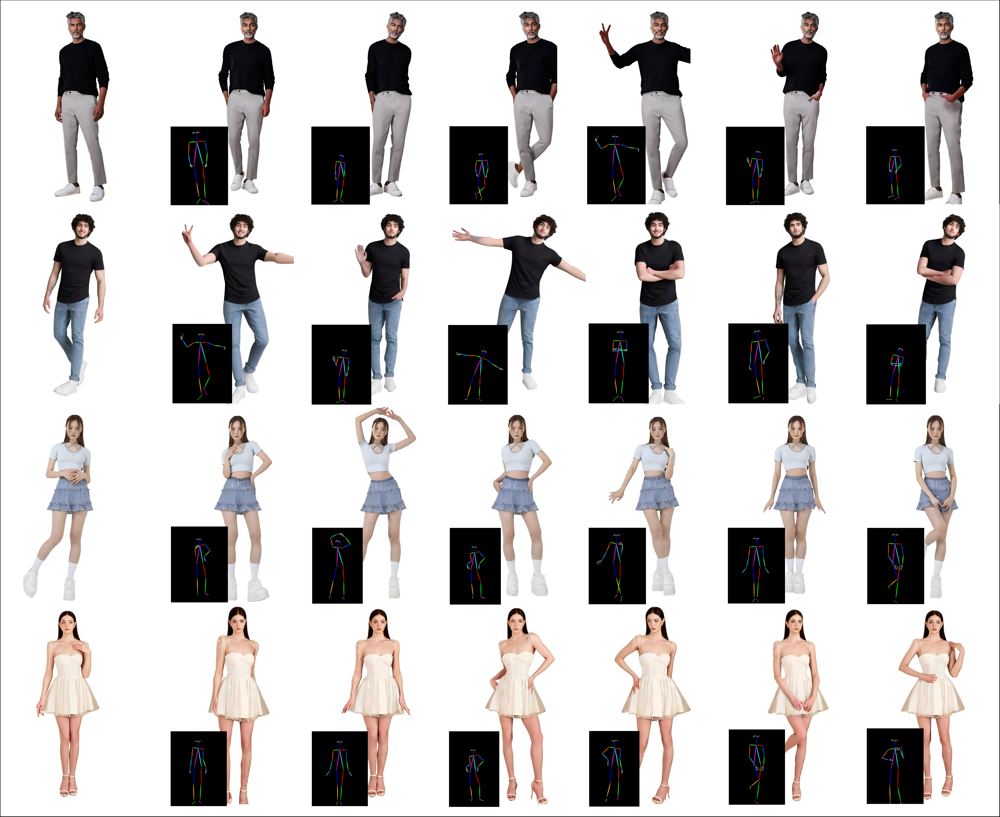

<div align="center">
<h1>PhotoPoster: A high-fidelity two-stage pose-driven image generation framework</h1>
<a href='https://photo-poster.github.io/'></a>
<a href='https://huggingface.co/DynamicXLAB/PhotoPoster/tree/main'></a>
</div>


## Introduction
The field of portrait animation has seen significant advancements in recent years, largely due to progress in diffusion models. To support and further this research, we are excited to launch PhotoPoster, an open project for pose-driven image generation.In the realm of image-to-image (i2i) translation, PhotoPoster stands out by incorporating a refinement stage to significantly enhance overall image quality. For more detailed information and visual demonstrations, please visit our [project page](https://photo-poster.github.io).

We are committed to **opening complete source code for free and regularly updating PhotoPoster with several planned enhancements**, including improvements in algorithm module engineering, data processing pipelines, and training code optimization.Additionally, we are gearing up to release DynamicPose, a complementary image-to-video (i2v) project, which will further bolster our initiatives.

**If you are interested in exploring or contributing to any of these modules, please feel free to email us for project discussions**. BTW, if our open source work can benefit you, we would greatly appreciate it if you could give us a star ⭐!


## News
- [08/21/2024] 🔥 Release `PhotoPoster` project and pretrained models.
- In the coming two weeks, we will release comfyui of PhotoPoster and DynamicPose.

## Demos


## Todo:
- [x] Release inference codes and checkpoints of pre generation stage.
- [x] Release inference codes and checkpoints of hand restoration net.
- [x] Release pose server based FaseAPI.
- [ ] Release Comfyui of the PhotoPoster.
- [ ] Release project of DynamicPose.
- [ ] Release inference codes and checkpoints of face restoration net.
- [ ] Release training codes.
- [ ] Release the data cleaning and preprocessing pipeline code.
- [ ] Huggingface Gradio demo.

## Contents

- [Getting Started](#getting-started)
- [Inference](#inference)
- [Acknowledgement](#acknowledgement)
- [License](#license)


## Getting Started

### 1. Installation

We recommend a python version >=3.10 and cuda version =11.7. Then build environment as follows:

* Build environment
```shell
pip install -r requirements.txt
```

* mmlab packages
```shell
pip install --no-cache-dir -U openmim 
mim install mmengine 
mim install "mmcv>=2.0.1" 
mim install "mmdet>=3.1.0" 
mim install "mmpose>=1.1.0" 
```

### 2. Download weights

You can download weights manually as follows.

* pose server
	* [DWPose](https://github.com/IDEA-Research/DWPose?tab=readme-ov-file#-dwpose-for-controlnet)
	* [RTMPose](https://github.com/open-mmlab/mmpose/tree/main/projects/rtmpose)

* pre generation
	* Download the weights of these components:
		* [SD1.5](https://huggingface.co/runwayml/stable-diffusion-v1-5)
		* [sd-vae-ft-mse](https://huggingface.co/stabilityai/sd-vae-ft-mse)
		* [image_encoder](https://huggingface.co/lambdalabs/sd-image-variations-diffusers/tree/main/image_encoder)
	* Download our trained [weights](https://huggingface.co/DynamicXLAB/PhotoPoster/tree/main/stage1), which include three parts: denoising_unet.pth, reference_unet.pth and pose_guider.pth.
 
* hand restoration
	* Download the weights of [sd-2-inpaint](https://huggingface.co/stabilityai/stable-diffusion-2-inpainting)
	* Download our trained [weights](https://huggingface.co/DynamicXLAB/PhotoPoster/tree/main/controlnet), which include two parts: config.json and diffusion_pytorch_model.safetensors.

Finally, these weights should be organized in `pretrained_weights` as follows:
```
./pretrained_weights/
|-- rtmpose
|   |-- rtmdet_m_640-8xb32_coco-person.py
|   |-- rtmdet_m_8xb32-100e_coco-obj365-person-235e8209.pth
|   |-- rtmpose-x_8xb256-700e_coco-384x288.py
|   |-- rtmpose-x_simcc-body7_pt-body7_700e-384x288-71d7b7e9_20230629.pth
|   |-- rtmw-x_8xb320-270e_cocktail14-384x288.py
|   └── rtmw-x_simcc-cocktail14_pt-ucoco_270e-384x288-f840f204_20231122.pth
|-- dwpose
|   |-- dw-ll_ucoco_384.onnx
|   └── yolox_l.onnx
|-- stable-diffusion-v1-5
|   |-- feature_extractor
|   |   └── preprocessor_config.json
|   |-- model_index.json
|   |-- unet
|   |   |-- config.json
|   |   └── diffusion_pytorch_model.bin
|   └── v1-inference.yaml
|-- sd-vae-ft-mse
|   |-- config.json
|   └── diffusion_pytorch_model.bin
|-- image_encoder
|   |-- config.json
|   └── pytorch_model.bin
|-- stage1
|   |-- denoising_unet.pth
|   |-- reference_unet.pth
|   └── pose_guider.pth
|-- stable-diffusion-2-inpainting
|   |-- feature_extractor
|   |   └── preprocessor_config.json
|   |-- scheduler
|   |   └── scheduler_config.json
|   |-- text_encoder
|   |   |-- config.json
|   |   └── pytorch_model.bin
|   |-- tokenizer
|   |   |-- merges.txt
|   |   |-- special_tokens_map.json 
|   |   |-- tokenizer_config.json
|   |   └── vocab.json
|   |-- unet
|   |   |-- config.json
|   |   └── diffusion_pytorch_model.bin
|   |-- vae
|   |   |-- config.json
|   |   └── diffusion_pytorch_model.bin
|   └── model_index.json
└── controlnet
    |-- config.json
    └── diffusion_pytorch_model.safetensors
```


## Inference
### 1. pose server
Firstly, you need to prepare the pose images and human keypoint coordinates extracted from the original images. Considering that the pose models are frequently queried, to avoid loading the same model multiple times and improve the usability of the pose module, we deployed the pose models' inference service using a simple FastAPI script. And we also provides a concise client demo.
Specifically, you only need to run the following script to deploy the pose script's inference service, and keep it running in the program background without terminating it.
```
nohup python3 -m src.pose.pose_server configs/pose_server.yaml &
```
The following is a simple client script. And you will get two new files: assets/stage1/ref_img1.png.pose.png and assets/stage1/ref_img1.png.pose.pkl, which represent the pose image and keypoint information, respectively.
```
python3 -m scripts.pose_infer --image_path assets/stage1/ref_img1.png
```

### 2. pre generation 
Here is the cli command for running stage1 inference scripts:
```
CUDA_VISIBLE_DEVICES=0, python3 -m scripts.pose2img --config ./configs/animation_stage1.yaml -W 512 -H 768 --world_size 1 --global_id 0
```
You can modify the configuration file to change the image you want to test. Additionally, we have implemented a simple yet useful distributed inference computation framework in the inference code. If you have multiple GPUs and want to enable multiple computing processes for large-scale computation, you can modify the CUDA_VISIBLE_DEVICES, world_size, and global_id parameters and run multiple inference scripts simultaneously. The inference speed will exhibit linear growth.
### 3. hand restoration
The hand restoration network requires the output of stage1, including the result image and the pose image (aligned), as input. Here is the cli command for running hand restoration inference scripts:
```
CUDA_VISIBLE_DEVICES=0,  python3 -m scripts.hand_inpaint --config configs/hand_inpaint.yaml --world_size 1 --global_id 0
```


## Acknowledgement
1. We thank [AnimateAnyone](https://github.com/HumanAIGC/AnimateAnyone) for their technical report, and have refer much to [Moore-AnimateAnyone](https://github.com/MooreThreads/Moore-AnimateAnyone) and [diffusers](https://github.com/huggingface/diffusers).
1. We thank open-source components like [dwpose](https://github.com/IDEA-Research/DWPose), [Stable Diffusion](https://github.com/CompVis/stable-diffusion), [rtmpose](https://github.com/open-mmlab/mmpose/tree/main/projects/rtmpose), etc.. 


## License
1. `code`: The code of PhotoPoster is released under the MIT License.
2. `other models`: Other open-source models used must comply with their license, such as `sd2-inpainting`, `dwpose`, `rtmpose`, etc..


## Citation
```bibtex
@software{photoposter,
  author = {Yanqin Chen, Changhao Qiao, Yufei Cai, Sijie Xu, Yang Chen, Wei Zhu, Dejia Song},
  title = {PhotoPoster: A high-fidelity two-stage pose-driven image generation framework},
  month = {August},
  year = {2024},
  url = {https://github.com/dynamic-X-LAB/PhotoPoster}
}
```
